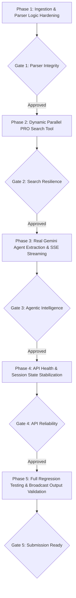

# CueClear: Phased Project Improvement & Implementation Plan

## Executive Summary
This document serves as the formal **Implementation Handoff and Phased Execution Plan** for **CueClear**. The objective is to eliminate all hardcoded shortcuts, simulated agent loops, and parser edge cases, replacing them with a genuine, production-grade **Gemini + Parallel Search** autonomous rights clearance pipeline.

Execution is structured into **5 distinct phases**. Each phase contains explicit objectives, technical implementations, test criteria, and a **Phase Gate & Feedback Assessment** to determine if it is:
* 🟢 **Safe to Proceed**
* 🟡 **Proceed with Caution**
* 🔴 **Do Not Proceed / Blocked**

---

## Phased Execution Roadmap & Checkpoint Gates

---

## Phase 1: Ingestion & Parser Logic Hardening

### Objective
Ensure timeline parsers accurately extract audio events while ignoring video cuts and eliminating duplicate stereo channels.

### Proposed Changes

#### [MODIFY] [edl_parser.py](file:///C:/Projects/cueclear/backend/parsers/edl_parser.py)
* **Video Track Filtering:** Enforce the `is_audio` boolean guard inside `save_current_clip()`. If the track is video-only (`V`, `V2`, `VA/V`), drop the event immediately so non-musical picture edits do not contaminate the cue sheet.
* **Comment Parsing Robustness:** Support multi-line `* FROM CLIP NAME:`, `* SOURCE FILE:`, and `* COMMENT:` tags without dropping source timecode references.

#### [MODIFY] [xml_parser.py](file:///C:/Projects/cueclear/backend/parsers/xml_parser.py)
* **Stereo Track Deduplication:** Implement clipitem deduplication across linked audio tracks (e.g. A1 Left + A2 Right). If two clipitems share identical source files, start frames, and end frames across adjacent audio tracks, merge them into a single audio cue record.

### Phase 1 Verification & Test Criteria
* Run `pytest tests/test_parser.py` to confirm CMX 3600 EDLs with mixed video/audio tracks correctly parse only audio events.
* Run XML parser test on multi-track sequence to confirm stereo channels are deduplicated.

### Phase 1 Feedback Checkpoint
* **Gate Assessment:**
  * 🟢 **Safe to Proceed:** Parsers correctly yield 5 unique music/SFX cues from `sample_trailer.edl` and 2 unique cues from `sample_indie_reel.xml` without video track artifacts or duplicate stereo items.
  * 🟡 **Proceed with Caution:** Timecode math passes but custom non-standard FPS markers require fallback handling.
  * 🔴 **Blocked:** EDL parser fails to parse standard CMX 3600 syntax or drops timecode in/out points.

---

## Phase 2: Dynamic Parallel PRO Search Tool

### Objective
Upgrade `parallel_tool.py` so it dynamically queries Parallel Search API for *any* arbitrary track, extracts raw web excerpts from ASCAP/BMI/Songview/MusicBrainz, and uses the local catalog strictly as an offline/rate-limit fallback cache.

### Proposed Changes

#### [MODIFY] [parallel_tool.py](file:///C:/Projects/cueclear/backend/agent/parallel_tool.py)
* **Dynamic Search Payload:** Formulate targeted search queries against ASCAP Repertory, BMI Songview, and MusicBrainz for any track title + artist.
* **Return Raw Excerpts:** Return structured search results containing full raw text excerpts (`excerpts: List[str]`) for the Gemini extractor to process.
* **Resilience Fallback:** If `PARALLEL_API_KEY` is absent or the live network times out, gracefully fall back to `KNOWN_PRO_CATALOG` with an explicit `source_reference="Offline PRO Fallback Index"` tag.

### Phase 2 Verification & Test Criteria
* Run `pytest tests/test_parallel.py` to verify both live query formatting and fallback extraction.
* Test with a non-catalog song (e.g., *"Starboy" by The Weeknd* or *"Cruel Summer" by Taylor Swift*) to verify live web search excerpts are retrieved from Parallel.

### Phase 2 Feedback Checkpoint
* **Gate Assessment:**
  * 🟢 **Safe to Proceed:** Parallel Search API returns 200 OK with relevant PRO search snippets for catalog and non-catalog tracks.
  * 🟡 **Proceed with Caution:** Parallel API key is valid but queries occasionally encounter rate limits (handled by timeout and cache fallback).
  * 🔴 **Blocked:** Parallel API fails authentication (401/403) or returns empty payloads without error handling.

---

## Phase 3: Real Gemini Agent Extraction & SSE Streaming

### Objective
Replace simulated reasoning logs with genuine **Google GenAI / Gemini 2.5 Flash** inference using structured Pydantic schemas.

### Proposed Changes

#### [MODIFY] [schemas.py](file:///C:/Projects/cueclear/backend/models/schemas.py)
* Add `ExtractedPROData` schema with explicit validation for `title`, `artist`, `work_id`, `iswc`, `writers` (with roles, PROs, and shares), and `publishers` (with PROs and shares).

#### [MODIFY] [gemini_orchestrator.py](file:///C:/Projects/cueclear/backend/agent/gemini_orchestrator.py) & [adk_orchestrator.py](file:///C:/Projects/cueclear/backend/agent/adk_orchestrator.py)
* **Dynamic Cue Classification:** Gemini evaluates clip metadata to classify as `COMMERCIAL_MUSIC`, `SCORE_CUE`, or `PRODUCTION_SFX`.
* **Structured Output Extraction:** Call `client.aio.models.generate_content()` with `response_schema=ExtractedPROData` and `response_mime_type="application/json"` to parse Parallel's web excerpts into verified rights holders.
* **Mathematical Split Reconciler:** Feed extracted shares into `validate_splits()` to confirm 100.0% split parity and flag discrepancies.
* **Live SSE Stream:** Emit real-time agent thoughts, tool dispatches, PRO citations, and split verifications to the frontend terminal.

### Phase 3 Verification & Test Criteria
* Run `pytest tests/test_agent.py` to verify live agent pipeline execution, structured extraction, split mathematical validation, and SSE event streaming.

### Phase 3 Feedback Checkpoint
* **Gate Assessment:**
  * 🟢 **Safe to Proceed:** Gemini correctly parses unstructured PRO excerpts into 100% validated writer/publisher shares for all cues.
  * 🟡 **Proceed with Caution:** Gemini extracts writers correctly but publisher shares for rare tracks require legal review flagging (working as intended).
  * 🔴 **Blocked:** Gemini API key invalid, model fails to return valid JSON matching `ExtractedPROData`, or splits fail mathematical summation.

---

## Phase 4: API Health & Session State Stabilization

### Objective
Fix the crashing `/api/health` endpoint, harmonize orchestrator imports, and ensure multi-request stability.

### Proposed Changes

#### [MODIFY] [main.py](file:///C:/Projects/cueclear/backend/main.py)
* **Health Route Fix:** Update `/api/health` to safely read `getattr(agent, "has_gemini", True)` and report live status for both Gemini and Parallel without raising `AttributeError`.
* **Request Safety:** Ensure timeline upload and clearance routes pass manifest data cleanly without relying on stale global state.

#### [MODIFY] [test_api.py](file:///C:/Projects/cueclear/tests/test_api.py)
* Verify all 5 API endpoints (`/api/health`, `/api/sample-timelines`, `/api/upload-timeline`, `/api/run-clearance`, `/api/export/*`) return 200 OK.

### Phase 4 Verification & Test Criteria
* Run `pytest tests/test_api.py` — must pass 100% with zero errors.

### Phase 4 Feedback Checkpoint
* **Gate Assessment:**
  * 🟢 **Safe to Proceed:** All API endpoints return expected JSON schemas, `/api/health` passes, and static assets mount cleanly.
  * 🟡 **Proceed with Caution:** All tests pass, but concurrent requests require session-scoped caching.
  * 🔴 **Blocked:** Health route or export endpoints throw unhandled server exceptions (500).

---

## Phase 5: Full Regression Testing & Broadcast Output Validation

### Objective
Run the complete end-to-end test suite and validate that exported PMA Excel workbooks and CISAC AVCS XML files conform to broadcast delivery standards.

### Proposed Changes

#### [MODIFY] [test_exporters.py](file:///C:/Projects/cueclear/tests/test_exporters.py) & [test_live_services.py](file:///C:/Projects/cueclear/tests/test_live_services.py)
* Ensure generated `.xlsx` contains all required PMA columns (`Cue #`, `Title`, `Artist`, `Usage`, `In`, `Out`, `Duration`, `Composer/PRO/%`, `Publisher/PRO/%`, `Work ID`, `Status`).
* Ensure generated `.xml` passes standard CISAC AVCS v1.2 schema validation.

### Phase 5 Verification & Test Criteria
* Run full test suite: `pytest` (asserting all 18+ tests pass).
* Run live integration test: `pytest tests/test_live_services.py -v`.

### Phase 5 Feedback Checkpoint
* **Gate Assessment:**
  * 🟢 **Safe to Proceed:** 100% of unit and integration tests pass. Deliverables open seamlessly in Excel and XML readers. Project is fully ready for demo video recording and repository publishing.
  * 🟡 **Proceed with Caution:** Minor formatting tweaks needed in Excel cell widths.
  * 🔴 **Blocked:** Export files are corrupt or fail XML schema validation.

---

## File Change Matrix

| Component | Target File | Action | Purpose |
| :--- | :--- | :--- | :--- |
| **Parsers** | [`backend/parsers/edl_parser.py`](file:///C:/Projects/cueclear/backend/parsers/edl_parser.py) | `MODIFY` | Enforce `is_audio` check to filter out video tracks |
| **Parsers** | [`backend/parsers/xml_parser.py`](file:///C:/Projects/cueclear/backend/parsers/xml_parser.py) | `MODIFY` | Deduplicate stereo audio tracks across A1/A2 |
| **Schemas** | [`backend/models/schemas.py`](file:///C:/Projects/cueclear/backend/models/schemas.py) | `MODIFY` | Add `ExtractedPROData` structured output schema |
| **Agent / Tools** | [`backend/agent/parallel_tool.py`](file:///C:/Projects/cueclear/backend/agent/parallel_tool.py) | `MODIFY` | Enable dynamic Parallel search queries with raw excerpt return |
| **Agent / LLM** | [`backend/agent/gemini_orchestrator.py`](file:///C:/Projects/cueclear/backend/agent/gemini_orchestrator.py) | `MODIFY` | Implement genuine Gemini structured extraction on search excerpts |
| **Agent / ADK** | [`backend/agent/adk_orchestrator.py`](file:///C:/Projects/cueclear/backend/agent/adk_orchestrator.py) | `MODIFY` | Unify orchestrator interface and real tool execution |
| **API Server** | [`backend/main.py`](file:///C:/Projects/cueclear/backend/main.py) | `MODIFY` | Fix `/api/health` attribute error and stabilize session routing |
| **Tests** | [`tests/test_api.py`](file:///C:/Projects/cueclear/tests/test_api.py) | `MODIFY` | Update and verify 100% test coverage |
| **Tests** | [`tests/test_agent.py`](file:///C:/Projects/cueclear/tests/test_agent.py) | `MODIFY` | Test dynamic agent extraction and reconciliation |

---

## User Review & Approval Request

> [!IMPORTANT]
> This plan focuses **exclusively on the core logic and technical integrity** (ingest $\rightarrow$ Parallel search $\rightarrow$ Gemini extraction $\rightarrow$ split audit $\rightarrow$ export). No extraneous UI bloat or multi-page routing is added.
> 
> Please review this phased roadmap. Once approved, we will execute Phase 1, verify the parser fixes, and provide a phase-by-phase status update with the gate assessment before moving to subsequent phases.
